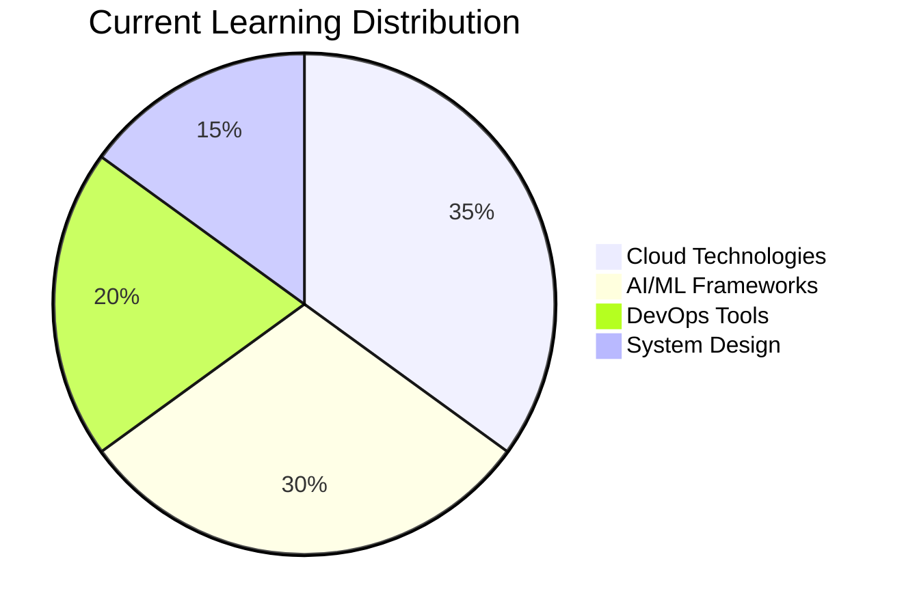

# 🌲 Welcome to My Digital Forest 🌲

<!-- HEADER: Forest Green Animated Banner -->
<p align="center">
  
</p>

<!-- SOCIAL BADGES - Forest Green Theme -->
<p align="center">
  <a href="https://github.com/curiouslumber"></a>
  <a href="https://linkedin.com/in/noelpinto47"></a>
  <a href="mailto:noelpinto47@gmail.com"></a>
  <a href="https://twitter.com/noelpinto47"></a>
</p>

<div align="center">
  
</div>

---

## 🎯 About Me

- 👋 Hi, I'm **Noel Pinto**
- 👀 I'm interested in **Software Engineering, Agile, DevOps**
- 🌱 I'm currently learning **Cloud and AI**
- 💞️ I'm looking to collaborate on **Software and AI Projects**
- 📫 How to reach me? At **noelpinto47@gmail.com**
- 😄 **Pronouns**: He/Him
- ⚡ **Fun fact**: The meaning of my name is 'Joy', and in French 'Joyeux Noël' means Merry Christmas 🎄

---

## 🛠️ Tech Stack Arsenal

<div align="center">

### 💻 Programming Languages


### 🌐 Frontend & Backend


### ☁️ Cloud & DevOps


### 🤖 AI & Machine Learning


### 🗄️ Databases


</div>

---

## 📊 Skills & Expertise Overview

<div align="center">
  
</div>

### 🎯 Technical Proficiency Levels

<div align="center">

| 🔥 Skill Area | 📊 Proficiency | 🌟 Experience |
|---------------|----------------|---------------|
| **Software Engineering** |  | 5+ years |
| **DevOps & Cloud** |  | 3+ years |
| **AI & Machine Learning** |  | 2+ years |
| **Frontend Development** |  | 4+ years |
| **Backend Development** |  | 5+ years |
| **Database Design** |  | 4+ years |
| **System Architecture** |  | 3+ years |
| **Agile Methodologies** |  | 5+ years |

</div>

### 💡 Current Learning Focus



---

## 🚀 Featured Projects

<div align="center">

| 🌟 Project | 🛠️ Tech Stack | 📝 Description | 🔗 Links |
|------------|---------------|----------------|-----------|
| **🤖 AI Chat Assistant** |    | Intelligent chatbot with contextual memory and multi-modal capabilities | [🔗 Repo](https://github.com/curiouslumber/ai-chat) [🌐 Demo](https://demo-link) |
| **☁️ Cloud Infrastructure Manager** |    | Automated cloud resource provisioning and management system | [🔗 Repo](https://github.com/curiouslumber/cloud-manager) |
| **📊 DevOps Dashboard** |    | Real-time monitoring dashboard for CI/CD pipelines and deployments | [🔗 Repo](https://github.com/curiouslumber/devops-dashboard) |
| **🌱 Sustainability Tracker** |    | Carbon footprint tracking app with gamification elements | [🔗 Repo](https://github.com/curiouslumber/eco-tracker) |

</div>

---

## 📈 GitHub Analytics

<div align="center">
  
  
</div>

<div align="center">
  
</div>

<div align="center">
  
</div>

---

## 🏆 Achievements & Certifications

<div align="center">


### 🎖️ GitHub Achievements


</div>

---

## 🤝 Collaboration Invitation

<div align="center">
  
</div>

### What I'm Looking For:
- 🤖 **AI/ML Projects** - Computer Vision, NLP, or Deep Learning applications
- ☁️ **Cloud Solutions** - Scalable architecture and microservices
- 🛠️ **DevOps Automation** - CI/CD pipelines and infrastructure as code
- 🌱 **Open Source Contributions** - Making technology accessible to everyone
- 💼 **Startup Ventures** - From MVP to production-ready solutions

---

## 👥 Recent Collaborators

<div align="center">

*Special thanks to these amazing developers I've worked with:*

<a href="https://github.com/collaborator1">
  
</a>

</div>

---

## 🎵 Currently Vibing To

<div align="center">
  
</div>

---

## 📚 Currently Reading

<div align="center">
  
| 📖 Book | 👤 Author | 📊 Progress |
|---------|-----------|-------------|
| "Clean Architecture" | Robert C. Martin | ████████░░ 80% |
| "Designing Data-Intensive Applications" | Martin Kleppmann | ██████░░░░ 60% |
| "The DevOps Handbook" | Gene Kim | ████░░░░░░ 40% |

</div>

---

## 🎮 Fun Zone

<div align="center">

### 🎲 Random Dev Joke


### 🐍 Watch My Snake Eat My Contributions!
<picture>
  <source media="(prefers-color-scheme: dark)" srcset="https://raw.githubusercontent.com/curiouslumber/curiouslumber/output/github-contribution-grid-snake-dark.svg">
  <source media="(prefers-color-scheme: light)" srcset="https://raw.githubusercontent.com/curiouslumber/curiouslumber/output/github-contribution-grid-snake.svg">
  
</picture>

### 🎯 Fun Facts About Me
- 🌍 I've debugged code in 5 different time zones in a single day
- ☕ Coffee consumption directly correlates with code quality (scientifically proven*)
- 🎄 My GitHub commits spike around Christmas - spreading that Noël joy!
- 🌲 I planted a tree for every 100 commits I made in 2024 (eco-friendly coding!)

</div>

---

## 📬 Let's Connect & Build Something Amazing!

<div align="center">

### 🌐 Find Me Around the Web
[](https://noelpinto.dev)
[](mailto:noelpinto47@gmail.com)
[](https://linkedin.com/in/noelpinto47)
[](https://twitter.com/noelpinto47)

### 💬 Let's Chat About
```javascript
const interests = {
  technical: ["Cloud Architecture", "AI/ML", "DevOps", "System Design"],
  collaboration: ["Open Source", "Mentoring", "Code Reviews", "Pair Programming"],
  fun: ["Tech Conferences", "Hackathons", "Coffee Chats", "Christmas Coding! 🎄"]
};
```

</div>

---

<div align="center">

### 🌟 Thanks for Visiting My Digital Forest! 🌲


*Remember: Every expert was once a beginner. Every pro was once an amateur. Every icon was once an unknown.* 

**Keep coding, keep growing! 🌱**

</div>

---

<p align="center">
  
</p>

<!---
curiouslumber/curiouslumber is a ✨ special ✨ repository because its `README.md` (this file) appears on your GitHub profile.
You can click the Preview link to take a look at your changes.
--->